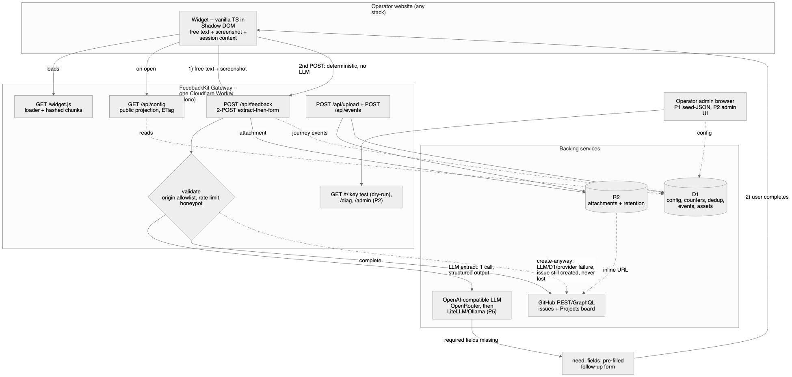

# Architecture

> Diagram triplet (single source: [`architecture.mmd`](architecture.mmd)):
> [`.svg`](architecture.svg) (vector) · [`.png`](architecture.png) (raster) · [`.excalidraw`](architecture.excalidraw) (open at excalidraw.com → File → Open to edit, then re-render from the `.mmd`).

## One artifact, one deploy

FeedbackKit is a **single Cloudflare Worker** (Hono). It serves everything — the widget bundle, the public config, the feedback API, and (from P2) the admin UI — backed by **D1** (config + operational data) and **R2** (attachments). Operators self-host it; there is no central FeedbackKit service. See the invariants and phase scope in [ROADMAP.md](ROADMAP.md).

## Components

- **Widget** — vanilla TS in a Shadow DOM, loaded from `GET /widget.js` (small loader + hashed, immutable chunks). Runs on any site, including React/Next. Collects free text, a screenshot, and session context (browser, OS, viewport, console errors, URL). Configured by exactly two attributes; everything else comes from `GET /api/config`.
- **Gateway Worker** — endpoints: `/widget.js`, `/api/config` (public projection, ETag), `/api/feedback` (the 2-POST extract-then-form), `/api/upload`, `/api/events` (enum-only funnel), `/t/:key` (test page, dry-run default), `/diag`, and `/admin` + `/api/admin/*` (from P2). Every write passes the same gate: origin allowlist (anchored regex + bounded-TTL cache), per-IP rate limit, honeypot.
- **D1** — projects config (JSON + stable field IDs), counters, dedup, feedback-journey events, and the assets index (retention).
- **R2** — attachments with app-level retention + an admin-authed delete endpoint; rendered inline in the issue via URL.
- **LLM endpoint** — OpenAI-compatible (OpenRouter default; LiteLLM/Ollama/local in P5). One call per feedback, structured output, server-side Zod validation as the hard gate.
- **Issue tracker** — GitHub REST/GraphQL (issues + Projects board) in v1; provider-pluggable (GitLab/Jira/Trello gated to P4; webhook sink from P2).

## The feedback flow

1. The widget POSTs free text + screenshot to `/api/feedback`.
2. The gate validates (origin, rate limit, honeypot), then the LLM extracts fields against the project's template in **one** structured-output call.
3. If required fields are missing, the Worker returns `need_fields`; the widget shows a **pre-filled follow-up form** ("Almost done — N details missing").
4. The user completes it; a **second, deterministic POST** (no LLM) creates the GitHub issue with the attachment inlined from R2.

## Create-anyway (never lose feedback)

Any backend failure degrades instead of dropping feedback: LLM error/timeout → issue created unenriched (`ai-failed`); D1 unreachable → issue still created (`d1-degraded`, last-known-good config from isolate cache); issue-tracker error → payload persisted with `issue_failed` + retry in the admin.

## P1 vs P2

P1 ships the Worker + widget + LLM + a seed-JSON config (no admin UI); SCTT runs on it in production (drift = 0). P2 adds the full admin UI, annotation, the GitHub App manifest flow, theming, and the webhook sink. See [ROADMAP.md](ROADMAP.md) and [DECISIONS.md](DECISIONS.md).
